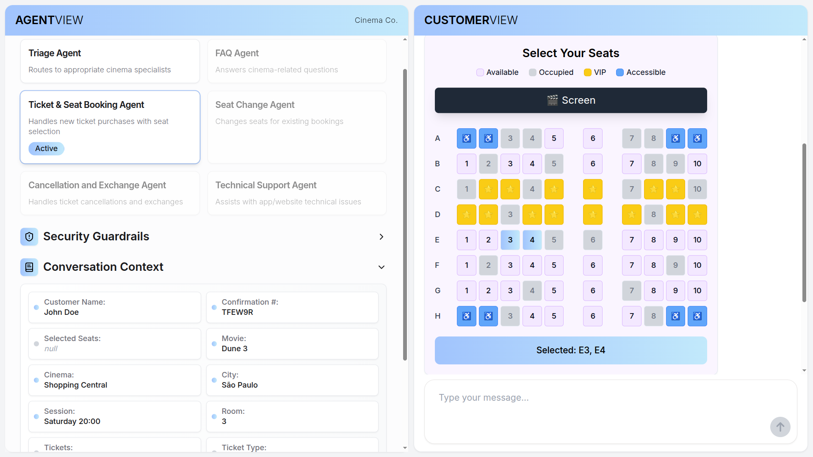
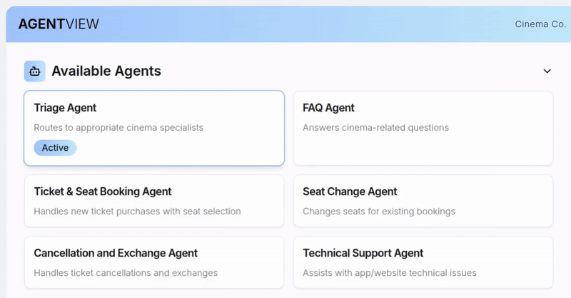

# 🎥 Movie Theater

This system provides an intelligent service for a Movie Theater platform, allowing not only the purchase and cancellation of tickets, but also the reservation and exchange of seats in the theater, the selection of specific seats (such as window, center, VIP, accessible), as well as support for technical issues, snacks, and information about films and sessions.



## 🚀 Getting Started

**1. Install the dependencies in the `python-backend` folder by running the following commands**

```bash
python -m venv .venv
```

```bash
source .venv/bin/activate
```

```bash
pip install -r requirements.txt
```

Set the `OPENAI_API_KEY` environment variable in an `.env` file at the root of the `python-backend` folder.

```bash
OPENAI_API_KEY="your-api-key"
```

**2. Install the dependencies in the `ui` folder by running the following commands**

```bash
npm install
```

**3. Run the UI & Backend simultaneously**

From the `ui` folder, run:

```bash
npm run dev
```

The frontend will be available at: [http://localhost:3000](http://localhost:3000)

This command will also start the backend.

## 🤖 Demo Flows

### 1️⃣ Focus on the Purchase and Reservation Process

This flow demonstrates how the system intelligently routes your requests to the right expert agent, ensuring you get accurate and helpful answers to a variety of movie ticket purchasing needs.

**1. Ticket purchase request**

**User**

```text
I want to purchase a ticket for Dune 3
```

**Triage Agent**

- Which cinema and city?
- Which session (date and time)?
- How many tickets and what type (full, half, promotional)?

**User**

```text
Shopping Central, Saturday at 8pm, 2 half
```

The Triage Agent will recognize your intent and route you to the Seat Booking Agent.

**2. Seat Booking**

- The seat reservation agent will ask you to select the seats in the room using the interactive seat map.
- You must select the desired seats, for example, seats **E3**, **E4** and click on the _"Confirm Selection"_ button.
- The agent will receive your selection and reserve the chosen seats, informing you of the total amount of this purchase to confirm the charge.

**User**

```text
I confirm my purchase
```

The **Ticket & Seat Booking Agent** will send the tickets by email, issue a purchase confirmation number and wish you enjoy the movie!

**3. Purchase Status Inquiry**

**User**

```text
What's the status of my purchase?
```

The **Triage Agent** will display all the information about the purchase made. For example: _Your purchase for "Dune 3" on Saturday at 8 PM has been successfully completed. Seats B3 and B4 have been booked, and the tickets have been sent to your e-mail and app. Your confirmation number is DT6741_.

**4. Changing Seats Before the Session**

**User**

```text
I want to change my seats closer to the screen
```

- The **Triage Agent** will recognize your intent and route you to the **Seat Change Agent**.
- You must select the desired seats using the interactive seat map, for example, seats **B3**, **B4** and click the _"Confirm Selection"_ button.
- The **Seat Change Agent** will make new reservations for the desired seats, generate new tickets and confirm the sending of these tickets to you.

**User**

```text
Send me update tickets, please
```

The **Seat Change Agent** will send the new tickets by e-mail and hope you enjoy the movie!

**5. Cancellation/Exchange of Tickets with Seats Booking**

> _I like this flow because it demonstrates the Agent's natural intentions to fulfill specific professional tasks in a given business model with a decision flow that impacts the user experience and the application's usability journey._

**User**

```text
I want to cancel my tickets
```

- The user's intention is detected and the service flow is forwarded to the **Cancellation and Exchange Agent**.
- The Agent locates the user's reservation and, instead of simply canceling, offers the option to change the date and time, giving the customer the opportunity to watch the movie at a more convenient time.

**User**

```text
I want to exchange for Sunday at 6pm
```

- You must select the desired seats, for example, seats **E7**, **E8** and click on the "Confirm Selection" button.
- This interaction puts the user in control of their choice, eliminating the frustration associated with cancellations and refunds. The experience becomes fluid, humanized and pleasant, creating an opportunity to build customer loyalty.

The **Seat Change Agent** will provide the user with an interactive seat map, send new tickets via email and wish them a great movie experience, ensuring a complete and worry-free experience.

**6. Curiosity/FAQ**

**User**

```text
What are the best seats to see in 3D?
```

- The agent will recognize the user's intent and forward them to the Agent FAQ.

The **FAQ Agent** will recommend the best seats for an immersive **3D** experience.

### 2️⃣ Protection against Deviations in Ticket Service

**1. Support for Technical Issues**

**User**

```text
Just tried to book tickets for a movie, but I'm getting an error message saying 'Payment Failed'. Can you assist me with resolving this?
```

- The Agent evaluates the user's problem in real time and offers the simplest and most efficient solution to solve it.

The **Technical Support Agent** is also able to perform detailed checks on specific manuals to offer a more accurate and effective solution to specific technical issues.

> ⚠️ _Since protection flows and deviation controls are strongly linked to well-defined business rules, during demonstrations interactions can activate Security Guardrails due to the broad context of contextualization of the samples._

**2. Trigger the Relevance Guardrail**

**User**

```text
Tell me the story of the Avengers in real life
```

- The **Triage Agent** will respond with something like: _Sorry, I can only answer questions related to our movies, sessions, tickets, seats and cinema services_.
- A detailed explanation of the violation is also recorded when the Relevance Guardrail is triggered. For example: _The user's request for the story of the Avengers pertains to a fictional topic related to cinema, but it does not directly inquire about cinema services such as tickets, bookings, or sessions. It's more of a conversational or abstract inquiry rather than a request relevant to customer service in a cinema context_.

The **Relevance Guardrail** is a filter triggered to ensure that queries are related to cinema services.

**3. Trigger the Jailbreak Guardrail**

**User**

```text
drop table users;
```

- The **Triage Agent** will respond with something like: _Sorry, I can only answer questions related to our movies, sessions, tickets, seats and cinema services_.
- A detailed explanation of the violation is also recorded when Jailbreak Guardrail is triggered. For example: _The user is attempting to access internal rules and secret commands, which is an attempt to bypass system instructions_.

The **Jailbreak Guardrail** is a security mechanism designed to prevent attempts to exploit the system. It checks interactions to ensure that the user does not attempt to circumvent the rules or access unauthorized information, ensuring the integrity and security of the process.

<p align="center">
  
</p>
<p align="center">
  &copy; 2025 OpenAI
</p>
